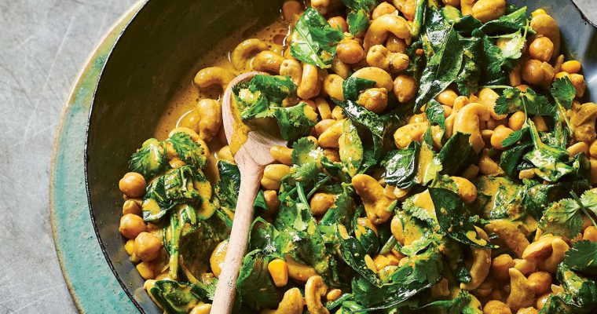

# Chickpea Spinach Curry

## Ingredients

### Curry
- 1 can chickpeas (strained)
- 2 tbsp tomato paste
- 400ml can coconut milk
- Frozen peas
- Sliced mushrooms
- 1/2 bag spinach
- Diced onion

### Spice Mix
- 1 tsp turmeric
- 2 tsp curry powder
- 1 tsp ground cumin
- 1 1/2 tsp garam masala
- 1 tsp paprika

## Steps

1. Fry onion until transparent.
2. Add mushrooms to pan and cook until withered.
3. Add spice mix and tomato paste and cook for a few minutes.
4. Add coconut milk, chickpeas, and peas and simmer to reduce.
5. Before serving, add spinach and allow it to wilt.
